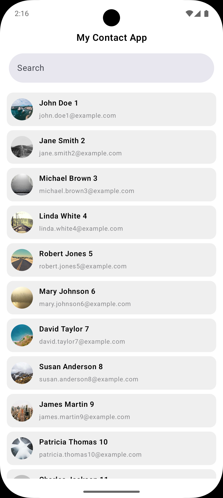
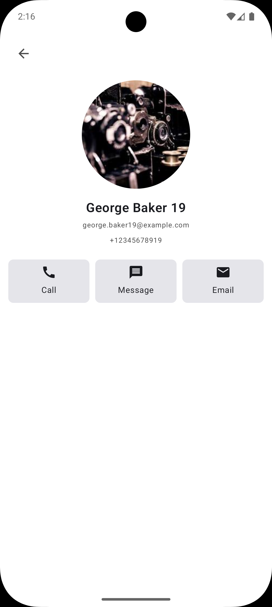

# Contacts App

A modern Android contacts app built with **Jetpack Compose**, **Clean Architecture**, and **MVVM + MVI** pattern.

---

## Features

- Browse contacts fetched from REST API
- Real-time contact search by name
- View detailed contact information
- Material Design 3 UI
- Splash Screen API (Android 12+)
- Type-safe navigation with Compose Navigation

---

## Screenshots

| Contact List | Contact Details |
|-------------|-----------------|
|  |  |
---

## Tech Stack

| Category | Technology                             |
|---|----------------------------------------|
| UI | Jetpack Compose, Material Design 3     |
| Architecture | MVVM, MVI, Clean Architecture          |
| Dependency Injection | Hilt                                   |
| Networking | Retrofit, OkHttp, Gson                 |
| Image Loading | Coil                                   |
| Async | Coroutines, Flow                       |
| Navigation | Jetpack Navigation Compose (type-safe) |
| Splash Screen | SplashScreen API                       |
| Animation | Lottie                                 |
| Language | Kotlin 2.0                             |

---

## Architecture

This app follows **Clean Architecture** with **MVI-style** presentation layer across three distinct layers:

```
┌───────────────────────────────────┐
│        Presentation Layer         │
│   Compose UI · ViewModel · UiState│
│     · UiActions (MVI Intent)      │
└────────────────┬──────────────────┘
                 │
┌────────────────▼─────────────────┐
│          Domain Layer            │
│   Use Cases · Models · Repository│
│            Interfaces            │
└────────────────┬─────────────────┘
                 │
┌────────────────▼─────────────────┐
│           Data Layer             │
│  Retrofit · DTOs · Repository    │
│         Implementations          │
└──────────────────────────────────┘
```

## Project Structure

```
com.emon.mycontactapp/
│
├── core/
│   ├── base/                   # BaseViewModel, common base classes
│   └── utils/                  # Extension functions, helpers
│
├── data/
│   ├── common/                 # Resource wrapper (Success/Error/Loading)
│   ├── mapper/                 # DTO → Domain model mappers
│   ├── remote/                 # Retrofit API interface & DTOs
│   └── repository/             # Repository implementations
│
├── di/
│   └── module/                 # Hilt modules (Network, Repository)
│
├── domain/
│   ├── common/                 # Shared domain utilities
│   ├── model/                  # Domain models
│   ├── repository/             # Repository interfaces
│   └── usecase/                # Use cases
│
├── presentation/
│   ├── MainActivity.kt
│   ├── navigation/             # AppNavigation, Routes
│   ├── contactlist/            # ContactListScreen, ViewModel, UiState
│   └── contactdetails/         # ContactDetailsScreen
│
└── ui/
    ├── components/             # Reusable Compose components
    └── theme/                  # MaterialTheme, Colors, Typography
```

---

## Getting Started

### Requirements

- Android Studio Meerkat (2024.3.1) or later
- Kotlin 2.0+
- Min SDK: 23
- Target SDK: 35
- JDK 17

### Setup

```bash
# Clone the repository
git clone https://github.com/em00n/My-Contact-App.git

# Navigate to project directory
cd My-Contact-App

# Build debug APK
./gradlew assembleDebug

# Or run directly on connected device
./gradlew installDebug
```

> **Note:** The app currently uses mock/placeholder data.
> To connect to a real API, update the `BASE_URL` and comment out `provideMockResponseOkHttpClient`
> also uncomment `provideOkHttpClient` in `NetworkModule.kt`.
---

## CI/CD

This project uses **GitHub Actions** to automatically build, sign, test, and distribute the app on every push or pull request to `master`.

### Pipeline Steps

```
Push / PR to master
        ↓
Checkout Code
        ↓
Setup JDK 21
        ↓
Decode Secrets (JKS, google-services.json, Firebase credentials)
        ↓
Cache Gradle Dependencies
        ↓
Run Unit Tests
        ↓
Build & Sign Release APK
        ↓
Upload APK as GitHub Artifact
        ↓
Upload to Firebase App Distribution
```

### Required GitHub Secrets

Go to `Settings → Secrets and variables → Actions` and add:

| Secret | Description |
|---|---|
| `JKS_BASE64` | Base64 encoded release keystore `.jks` file |
| `KEYSTORE_PASSWORD` | Keystore password |
| `KEY_ALIAS` | Key alias |
| `KEY_PASSWORD` | Key password |
| `GOOGLE_SERVICES_JSON` | Base64 encoded `google-services.json` |
| `FIREBASE_APP_ID` | Firebase App ID from project settings |
| `CREDENTIAL_FILE_CONTENT` | Base64 encoded Firebase service account credentials JSON |

### Firebase App Distribution

Signed APKs are automatically distributed to the **testers** group after every successful build. Testers receive an email notification with a download link.

## Contributing

Contributions are welcome! Please follow these steps:

1. Fork the repository
2. Create a feature branch (`git checkout -b feature/add-edit-contact`)
3. Commit your changes (`git commit -m 'Add edit contact screen'`)
4. Push to the branch (`git push origin feature/add-edit-contact`)
5. Open a Pull Request

---

## Contact

- LinkedIn: [Emon](https://www.linkedin.com/in/md-emon-hosen-86b4a221b/)
- GitHub: [@em00n](https://github.com/em00n)